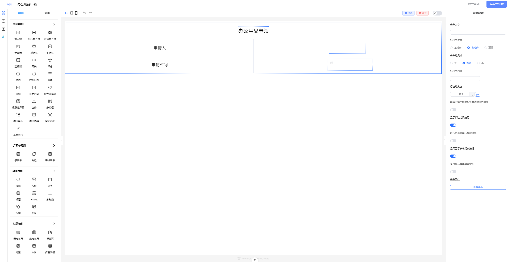
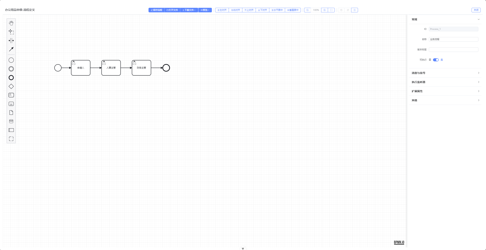

<h1 align="center">MingBo Seal Web</h1>
<p align="center">
  企业级电子签章审批工作流平台 · 前端
</p>
<p align="center">
  基于 Vue 3、TypeScript、Element Plus 和 Tailwind CSS 构建的现代化开源后台管理系统
</p>

<div align="center">简体中文 | <a href="./README.md">English</a></div>

<br />

<div align="center">

[](./LICENSE) [](https://github.com/ByteSmithJJ/mingbo-seal-web/stargazers) [](https://github.com/ByteSmithJJ/mingbo-seal-web/network/members)

</div>

<br />

## 项目简介

MingBo Seal Web（明博签章 · 前端）是 MingBo 品牌下的企业级电子签章审批工作流前端系统。覆盖**印章全生命周期管理**、**审批流程可视化设计**、**角色权限精细化控制**等核心能力，帮助组织快速落地数字化签章审批体系。

> 🔗 **后端服务**: [mingbo-seal-server](https://github.com/ByteSmithJJ/mingbo-seal-server) — Spring Boot 3 + Flowable 流程引擎

### 核心特性

- 🔐 **印章管理** — 印章创建、绑定、授权、挂失、销毁全生命周期管控
- 📋 **审批工作流** — 基于 BPMN 的可视化流程设计器，支持会签、或签、条件分支等复杂审批模式
- 👥 **权限控制** — 菜单级、按钮级、数据级三层权限体系，支持角色 + 授权码灵活组合
- 🎨 **现代化 UI** — 亮色/暗色双主题、四种菜单布局、七种主题色，兼顾美观与实用
- ⚡ **高效开发** — 内置 useTable、ArtForm、ArtSearchBar 等实用 API，显著提升开发效率
- 🌍 **国际化** — 内置中英文双语支持，可轻松扩展其他语言
- 🧹 **精简脚本** — 一键移除演示数据，快速获得可开发的基础项目框架

## 技术栈

| 类别     | 技术                                            |
| -------- | ----------------------------------------------- |
| 开发框架 | Vue 3 (Composition API)、TypeScript 5.6、Vite 7 |
| UI 框架  | Element Plus 2、Tailwind CSS 4                  |
| 状态管理 | Pinia 3（持久化插件）                           |
| 路由     | Vue Router 4（Hash 模式）                       |
| HTTP     | Axios（JWT 鉴权、自动刷新）                     |
| 流程设计 | BPMN.js                                         |
| 代码规范 | ESLint、Prettier、Stylelint、Husky、Commitlint  |

## 系统截图

<table>
  <tr>
    <td></td>
    <td></td>
  </tr>
  <tr>
    <td align="center"><strong>登录页</strong></td>
    <td align="center"><strong>工作台</strong></td>
  </tr>
  <tr>
    <td></td>
    <td></td>
  </tr>
  <tr>
    <td align="center"><strong>印章位置配置</strong></td>
    <td align="center"><strong>表单设计器</strong></td>
  </tr>
  <tr>
    <td></td>
    <td></td>
  </tr>
  <tr>
    <td align="center"><strong>BPMN 流程设计器</strong></td>
    <td align="center"><strong>发起流程</strong></td>
  </tr>
  <tr>
    <td colspan="2"></td>
  </tr>
  <tr>
    <td align="center" colspan="2"><strong>我的申请</strong></td>
  </tr>
</table>

## 快速开始

### 环境要求

- **Node.js** >= 20.19.0
- **pnpm** >= 8.8.0

### 安装运行

```bash
# 克隆仓库
git clone https://github.com/ByteSmithJJ/mingbo-seal-web.git
cd mingbo-seal-web

# 安装依赖
pnpm install

# 启动开发服务器
pnpm dev
```

浏览器访问 `http://localhost:3006` 即可预览。

### 生产构建

```bash
pnpm build    # 类型检查 + 生产构建
pnpm serve    # 预览构建结果
```

### 精简版本

项目内置清理脚本，可快速移除演示数据，获得一个干净的开发起点：

```bash
pnpm clean:dev
```

## 项目结构

```
mingbo-seal-web/
├── src/
│   ├── api/              # API 接口层
│   ├── assets/           # 静态资源（图片、样式、SVG）
│   ├── components/       # 组件
│   │   ├── core/         # 核心可复用组件（表格、表单、布局等）
│   │   └── business/     # 业务组件
│   ├── config/           # 全局配置（主题、菜单、颜色）
│   ├── hooks/            # 组合式函数（useTable、useChart 等）
│   ├── locales/          # 国际化（zh-CN / en）
│   ├── router/           # 路由（静态 + 动态权限路由）
│   ├── store/            # Pinia 状态管理
│   ├── types/            # TypeScript 类型定义
│   ├── utils/            # 工具函数
│   └── views/            # 页面组件
├── .github/              # GitHub 模板与 CI 工作流
├── docs/                 # 设计文档
├── scripts/              # 构建脚本（含 clean:dev）
├── .env                  # 环境变量
├── package.json
└── vite.config.ts
```

## 权限模型

系统支持两种权限模式（通过 `VITE_ACCESS_MODE` 环境变量切换）：

- **前端模式** (`frontend`)：菜单和权限在路由配置中静态定义
- **后端模式** (`backend`)：菜单和权限由后端 API 动态下发

内置 `v-auth` 和 `v-roles` 指令，可精确控制页面元素的显示与隐藏。

## 浏览器兼容性

支持 Chrome、Edge、Safari、Firefox 等现代主流浏览器的最新两个版本。

## 鸣谢

本项目基于以下优秀的开源项目构建，谨此致谢：

| 项目 | 用途 | 许可证 |
| --- | --- | --- |
| **[Art Design Pro](https://github.com/Daymychen/art-design-pro)** | 高颜值前台模板 | MIT |
| **[Vue](https://github.com/vuejs/core)** | 前端框架 | MIT |
| **[TypeScript](https://github.com/microsoft/TypeScript)** | 类型系统 | Apache 2.0 |
| **[Vite](https://github.com/vitejs/vite)** | 构建工具 | MIT |
| **[Element Plus](https://github.com/element-plus/element-plus)** | UI 组件库 | MIT |
| **[Tailwind CSS](https://github.com/tailwindlabs/tailwindcss)** | 原子化 CSS 框架 | MIT |
| **[Pinia](https://github.com/vuejs/pinia)** | 状态管理 | MIT |
| **[Vue Router](https://github.com/vuejs/router)** | 路由管理 | MIT |
| **[Axios](https://github.com/axios/axios)** | HTTP 客户端 | MIT |
| **[ECharts](https://github.com/apache/echarts)** | 数据可视化 | Apache 2.0 |
| **[Vue I18n](https://github.com/intlify/vue-i18n)** | 国际化 | MIT |
| **[Iconify](https://github.com/iconify/iconify)** | 图标库 | MIT |
| **[BPMN.js](https://github.com/bpmn-io/bpmn-js)** | 流程设计器 | 个人/商业许可 |
| **[form-create](https://github.com/xaboy/form-create)** | 表单设计器 | MIT |
| **[VueUse](https://github.com/vueuse/vueuse)** | 组合式工具集 | MIT |
| **[ESLint](https://github.com/eslint/eslint)** | 代码检查 | MIT |
| **[Prettier](https://github.com/prettier/prettier)** | 代码格式化 | MIT |

## 贡献

我们真诚欢迎每一位贡献者的参与！

- 📖 [贡献指南](./CONTRIBUTING.md) — 开发环境搭建与 PR 流程
- 📝 [行为准则](./CODE_OF_CONDUCT.md) — 社区行为规范
- 🔒 [安全政策](./SECURITY.md) — 安全漏洞报告流程

## 许可证

本项目基于 [MIT License](./LICENSE) 开源。

## Star 历史

[](https://www.star-history.com/#ByteSmithJJ/mingbo-seal-web&Date)
